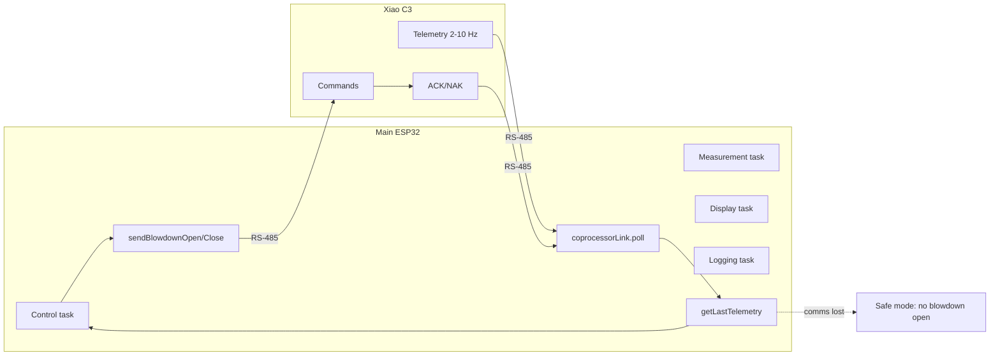

# Control Logic

## Overview

The Columbia CT-6 Boiler Dosing Controller runs on an ESP32-WROOM-32 and uses
FreeRTOS to schedule four cooperating tasks. This document maps the firmware's
execution lifecycle, state machines, decision logic, and key subroutines to
the source files in `firmware/esp32_boiler_controller/`.

---

## Architecture

```
┌──────────────────────────────────────────────────────────────────────────────────┐
│  Main ESP32 (Dual-Core)                    │  Optional: Xiao C3 (boiler panel)   │
│                                            │                                      │
│  Core 1                  Core 0            │  Telemetry (2–10 Hz) ────────────────┼──→ Main
│  ┌──────────────────┐   ┌──────────────┐  │    conductivity, temp, blowdown     │
│  │ taskControlLoop  │   │ taskDisplay  │  │    state, valve feedback, health    │
│  │ taskMeasurement  │   │ taskLogging  │  │  Commands (on event) ←──────────────┼── Main
│  └────────┬─────────┘   └──────────────┘  │    CMD_BLOWDOWN_OPEN/CLOSE, etc.    │
│           │                               │  ACK/NAK ────────────────────────────┼──→ Main
│           │ coprocessorLink.poll()        │                                      │
│           │ (when coprocessor present)    │  RS-485 half-duplex (Serial2)       │
│           └───────────────────────────────┼──────────────────────────────────────┘
│  Arduino loop()  ← processInputs()        │
│  ISR: Water meter (GPIO34), Encoder (15/2)│
└──────────────────────────────────────────────────────────────────────────────────┘
```

**Standalone:** No C3; conductivity from local EZO-EC + MAX31865, blowdown via GPIO4 and BlowdownController. **Coprocessor:** C3 sends telemetry; main sends commands; see [Coprocessor_Communication_Logic.md](Coprocessor_Communication_Logic.md) and Operating modes below.

### Operating modes

| Mode | Conductivity / temperature | Blowdown actuation | Valve feedback |
|------|----------------------------|--------------------|----------------|
| **Standalone** | `conductivitySensor` (EZO-EC + MAX31865 on main) | `BlowdownController` drives GPIO4 (relay) | ADS1115 on main I2C |
| **Coprocessor** | `coprocessorLink.getLastTelemetry()` (conductivity_uS_cm, temperature_c) | Main sends `sendBlowdownOpen()` / `sendBlowdownClose()`; C3 drives relay | Telemetry: valve_open, valve_feedback_mA, blowdown_state |

In coprocessor mode the **decision** state machine (when to open/close) runs on the main; **actuation** (relay, valve, feedback read) is on the C3. Main does not drive GPIO4. `main.cpp` does not yet branch on coprocessor mode; the intended behavior is as above and is implemented in `CoprocessorLink` and the protocol (see `include/coprocessor_link.h`, [Coprocessor_Communication_Logic.md](Coprocessor_Communication_Logic.md)).

**Data flow (coprocessor mode):**



### Source Files

| File | Purpose |
|------|---------|
| `src/main.cpp` | `setup()`, `loop()`, FreeRTOS task bodies, config I/O, alarm logic |
| `include/config.h` | All `typedef` structs, enums, defaults, NVS keys, task parameters |
| `include/pin_definitions.h` | GPIO assignments, hardware constants |
| `include/conductivity.h` / `src/conductivity.cpp` | `ConductivitySensor` — EZO-EC UART + MAX31865 SPI |
| `include/blowdown.h` / `src/blowdown.cpp` | `BlowdownController` — valve state machine, ADS1115 feedback |
| `include/chemical_pump.h` / `src/chemical_pump.cpp` | `ChemicalPump`, `PumpManager` — A4988 stepper control, feed modes A–F |
| `include/water_meter.h` / `src/water_meter.cpp` | `WaterMeter`, `WaterMeterManager` — pulse counting, flow rate, NVS persistence |
| `include/fuzzy_logic.h` / `src/fuzzy_logic.cpp` | `FuzzyController` — Mamdani inference, membership functions, rule base |
| `include/display.h` / `src/display.cpp` | `Display` — LCD screens, WS2812 LEDs, bar graphs |
| `include/data_logger.h` / `src/data_logger.cpp` | `DataLogger` — WiFi AP+STA, HTTP POST, buffered uploads, NTP sync |
| `include/sd_logger.h` / `src/sd_logger.cpp` | `SDLogger` — SD card CSV logging, daily file rotation, SPI mutex |
| `include/web_server.h` / `src/web_server.cpp` | `BoilerWebServer` — REST API + mobile web UI for manual test input |
| `include/coprocessor_protocol.h` / `src/coprocessor_protocol.cpp` | RS-485 inter-MCU protocol: frame format, message types, CRC16, validation |
| `include/coprocessor_link.h` / `src/coprocessor_link.cpp` | `CoprocessorLink` — main ESP32 side: send commands, receive telemetry/ACK, DE/RE half-duplex |

---

## Execution Lifecycle

### 1. Boot Sequence (`setup()` — `main.cpp:81`)

```
Power on / Reset
       │
       ▼
Serial.begin(115200)
       │
       ▼
Wire.begin(SDA=21, SCL=22, 400 kHz)    ← shared I2C: LCD + ADS1115
       │
       ▼
loadConfiguration()                      ← NVS "boiler_cfg" → system_config_t
  ├── Config blob present + magic OK?  → use stored config
  └── Missing / corrupt?              → initializeDefaults() → saveConfiguration()
       │
       ▼
[If coprocessor link enabled] coprocessorLink.begin(baud)  ← Serial2 + DE/RE for RS-485; skip local EZO/MAX31865 init if sensors on C3 (or keep for fallback)
       │
       ▼
display.begin()                          ← LCD init + custom chars + LED strip
       │
       ▼
conductivitySensor.begin()               ← UART2 init (9600), MAX31865 SW-SPI init
  └── configure(systemConfig.conductivity)  ← K, TDS factor, output selection
       │
       ▼
pumpManager.begin()                      ← 3x AccelStepper init, ENABLE pin HIGH (disabled)
  └── configure(systemConfig.pumps)
       │
       ▼
waterMeterManager.begin()                ← GPIO34 interrupt attach
  └── configure + loadAllFromNVS()       ← restore totalizers
       │
       ▼
blowdownController.begin()              ← GPIO4 OUTPUT LOW, ADS1115 probe
  └── configure(blowdown) + setConductivityConfig(conductivity)
       │
       ▼
dataLogger.begin()                       ← WiFi AP+STA connect, NTP sync
  └── connectWiFi()                      ← AP starts immediately; STA joins plant network
       │
       ▼
webServer.begin()                        ← HTTP server on port 80 (AP + STA)
       │
       ▼
sdLogger.begin()                         ← SD card on shared VSPI bus (GPIO19 CS)
       │
       ▼
xTaskCreatePinnedToCore × 4             ← Control, Measurement, Display, Logging
       │
       ▼
loop() runs  ← processInputs() every 10 ms
```

### 2. Steady-State Task Schedule

| Task | Core | Period | Stack | Priority | What It Does |
|------|------|--------|-------|----------|--------------|
| **Control** | 1 | 100 ms | 4 KiB | 4 | Blowdown update, fuzzy evaluate, pump feed modes, pump stepper update, alarm check |
| **Measurement** | 1 | 500 ms | 6 KiB | 3 | EZO-EC read (with RT temp comp), water meter update, system state update |
| **Display** | 0 | 200 ms | 4 KiB | 2 | LCD screen draw, WS2812 LED update |
| **Logging** | 0 | 1000 ms | 8 KiB | 1 | WiFi STA reconnect, web server handleClient, SD flush, periodic `logSensorData()` |

### 3. `loop()` — Input Polling (`main.cpp:218`)

Runs on whichever core is free (default Core 1). Calls `processInputs()` then yields for 10 ms.

---

## Control Task Detail (`taskControlLoop` — `main.cpp:233`)

Each 100 ms tick executes the following pipeline.

**If coprocessor present:** At start of tick, `coprocessorLink.poll()`. If `getLastTelemetry().valid`, use `conductivity_uS_cm` and `temperature_c` for fuzzy input and blowdown **decisions**; drive blowdown by sending `sendBlowdownOpen()` / `sendBlowdownClose()` (actuation is on C3). Valve position from telemetry: `valve_open`, `valve_feedback_mA`, `blowdown_state`. If **comms lost** (no telemetry within timeout): do not open blowdown; use last valid telemetry or safe defaults for display/logging; set or propagate a comms-lost alarm.

**If standalone:** Use conductivity from last Measurement reading; blowdown from `blowdownController.update()` and GPIO4.

```
┌─ updateFeedwaterPumpMonitor() ───────────────────────────────────┐
│   └── GPIO35 edge detect → cycle count, on-time, event logging  │
│                                                                   │
├─ [Coprocessor] coprocessorLink.poll(); if valid telemetry use    │
│   conductivity_uS_cm, temperature_c; send open/close commands.  │
│   [Standalone] Get conductivity from last Measurement reading     │
│                                                                   │
├─ [Standalone] blowdownController.update(conductivity)             │
│   └── state machine: IDLE → VALVE_OPENING → BLOWING_DOWN →       │
│       VALVE_CLOSING → IDLE  (see Blowdown State Machine below)   │
│                                                                   │
├─ Get water contacts + volume from waterMeterManager ─────────────┤
│                                                                   │
├─ Build fuzzy_inputs_t (cond, temp, manual alkalinity/sulfite/pH) ┤
│                                                                   │
├─ fuzzyController.evaluate(inputs) → fuzzy_result_t ──────────────┤
│   └── Mamdani inference: fuzzify → rule evaluation → defuzzify   │
│                                                                   │
├─ Map fuzzy outputs to pump array:                                 │
│   rates[H2SO3] = acid_rate                                        │
│   rates[NaOH]  = caustic_rate                                     │
│   rates[Amine] = sulfite_rate                                     │
│                                                                   │
├─ pumpManager.processFeedModes(blowdown_active, bd_time,          │
│                                contacts, volume, rates)           │
│   └── per-pump: check HOA → dispatch feed mode A–F               │
│                                                                   │
├─ pumpManager.update()  ← runs AccelStepper step calculations ────┤
│                                                                   │
└─ checkAlarms()  ← bitmask comparison, rising/falling edge detect ┘
```

---

## Blowdown State Machine (`blowdown.h` / `blowdown.cpp`)

**Coprocessor mode:** The **decision** state machine (when to open/close) stays on the main; **actuation** (relay, valve, feedback) is on the C3. Main sends open/close commands and uses telemetry for `valve_open`, `valve_feedback_mA`, and `blowdown_state` instead of local ADS1115 and GPIO4. See “Blowdown sequence (request → confirmation → final reading)” in [Coprocessor_Communication_Logic.md](Coprocessor_Communication_Logic.md): Main → CMD_BLOWDOWN_OPEN → C3 ACK → telemetry with valve open → … → CMD_BLOWDOWN_CLOSE → ACK → next telemetry as “final” reading.

### States

| State | Meaning |
|-------|---------|
| `BD_STATE_IDLE` | Valve closed, waiting for trigger |
| `BD_STATE_VALVE_OPENING` | GPIO4 HIGH → relay energized → 20 mA → ball valve opening |
| `BD_STATE_BLOWING_DOWN` | Valve open confirmed (feedback > 19 mA), draining |
| `BD_STATE_VALVE_CLOSING` | GPIO4 LOW → relay de-energized → 4 mA → ball valve closing |
| `BD_STATE_SAMPLING` | Intermittent mode: sample intake period |
| `BD_STATE_HOLDING` | Intermittent mode: trapped sample stabilization |
| `BD_STATE_WAITING` | Intermittent mode: interval between cycles |
| `BD_STATE_TIMEOUT` | Blowdown exceeded `time_limit_seconds` |
| `BD_STATE_ERROR` | Valve fault (feedback < 3 mA) or other error |

### Continuous Mode Transition Diagram

```
                   cond > setpoint
        IDLE ────────────────────────► VALVE_OPENING
         ▲                                    │
         │                           feedback > 19 mA
         │                           (or ball_valve_delay)
         │                                    │
         │                                    ▼
   VALVE_CLOSING ◄───────────────── BLOWING_DOWN
         │        cond < (setpoint             │
         │          - deadband)                │
         │                              timeout?
    feedback < 5 mA                           │
    (or delay elapsed)                        ▼
         │                              BD_STATE_TIMEOUT
         ▼                                    │
        IDLE                           (requires manual
                                        resetTimeout())
```

### Intermittent Mode (I / T / P)

```
  IDLE → SAMPLING → HOLDING → {decide} → BLOWING_DOWN → VALVE_CLOSING → WAITING → IDLE
                                  │
                                  └── Mode T: fixed blow_time_seconds
                                  └── Mode P: proportional to (cond - setpoint)
                                  └── Mode I: blow if cond > setpoint
```

### Key Methods

| Method | Purpose | Inputs | Side Effects |
|--------|---------|--------|--------------|
| `update(conductivity)` | Main tick — runs state machine | float | Drives GPIO4, reads ADS1115, updates `_status` |
| `processHOA()` | Checks HOA mode, forces open/close/auto | — | May override state machine |
| `processContinuousMode(cond)` | Continuous setpoint comparison | float | Transitions state |
| `processIntermittentMode(cond)` | I/T/P interval logic | float | Manages sample/hold/blow timers |
| `readFeedback()` | Reads ADS1115 CH0 → mA | — | Updates `_status.feedback_mA`, `position_confirmed`, `valve_fault` |
| `setRelayState(energize)` | Writes GPIO4 HIGH/LOW | bool | Drives SPDT relay coil |
| `startBallValve(opening)` | Begins valve transition | bool | Records `_valve_action_start`, sets `_valve_target_state` |
| `checkBallValveComplete()` | Checks feedback for position confirmation | — | Advances state on confirmation or timeout |
| `checkTimeout()` | Compares elapsed time against `time_limit_seconds` | — | Transitions to `BD_STATE_TIMEOUT` |

---

## Chemical Pump Feed Modes (`chemical_pump.h` / `chemical_pump.cpp`)

### Per-Pump Processing Flow

```
processFeedMode(blowdown_active, bd_time, contacts, volume, fuzzy_rate)
       │
       ▼
  check HOA mode
  ├── HOA_OFF  → stop(), return
  ├── HOA_HAND → start(), enforce 10-min timeout, return
  └── HOA_AUTO → continue to feed mode dispatch
       │
       ▼
  switch(config.feed_mode)
  ├── DISABLED         → stop()
  ├── A: Blowdown Feed → processModeA(blowdown_active)
  ├── B: % Blowdown    → processModeB(blowdown_active, bd_time)
  ├── C: % Time        → processModeC()
  ├── D: Water Contact  → processModeD(contacts)
  ├── E: Paddlewheel    → processModeE(volume)
  └── F: Fuzzy Logic    → processModeF(volume, fuzzy_rate)
```

### Feed Mode Details

| Mode | Trigger | Duration | Key Parameters |
|------|---------|----------|----------------|
| **A** | `blowdown_active` goes true | Runs while blowdown is active, up to `lockout_seconds` | `lockout_seconds` |
| **B** | Blowdown ends | `bd_time * percent_of_blowdown / 100` | `percent_of_blowdown`, `max_time_seconds` |
| **C** | Time-based duty cycle | `cycle_time * percent_of_time / 1000` on, rest off | `percent_of_time` (0.1% units), `cycle_time_seconds` |
| **D** | Water meter contact | `time_per_contact_ms` per N contacts | `time_per_contact_ms`, `contact_divider`, `assigned_meter` |
| **E** | Accumulated volume | `time_per_volume_ms` when volume >= `volume_to_initiate` | `time_per_volume_ms`, `volume_to_initiate` |
| **F** | Makeup water + fuzzy rate | `volume * ml_per_gallon_at_100pct * (fuzzy_rate / 100)` → steps via `steps_per_ml` | `ml_per_gallon_at_100pct`, `fuzzy_meter_select` |

### Stepper Motor Control

Each `ChemicalPump` wraps an `AccelStepper` instance:

- `start(duration_ms, volume_ml)` — sets target steps from volume or time, enables driver (GPIO13 LOW), begins stepping
- `update()` — calls `_stepper.run()` each tick, checks time/step limits, updates stats
- `stop()` — calls `_stepper.stop()`, disables driver (GPIO13 HIGH)
- Shared enable pin GPIO13 (active LOW) controls all three A4988 drivers

---

## Fuzzy Logic Inference (`fuzzy_logic.h` / `fuzzy_logic.cpp`)

### Pipeline

```
fuzzy_inputs_t (6 crisp values)
       │
       ▼
   ┌───────────┐
   │ Fuzzify   │  Per input variable: evaluate each membership function
   │           │  → float[6][7] input_membership degrees
   └─────┬─────┘
         │
         ▼
   ┌───────────┐
   │ Rule Eval │  For each of 64 rules:
   │           │    firing = t-norm(antecedent memberships)  [min or product]
   │           │    aggregate consequent output sets  [s-norm max]
   └─────┬─────┘
         │
         ▼
   ┌───────────┐
   │ Defuzzify │  Per output variable:
   │           │    centroid / bisector / MOM of aggregated set
   │           │    → crisp value 0–100%
   └─────┬─────┘
         │
         ▼
fuzzy_result_t
  .blowdown_rate    (0–100%)
  .caustic_rate     (0–100%)
  .sulfite_rate     (0–100%)
  .acid_rate        (0–100%)
  .active_rules     (count)
  .max_firing_strength
```

### Input Variables

| Index | Name | Source | Range |
|-------|------|--------|-------|
| 0 | TDS / Conductivity | EZO-EC via Measurement task | 0–10 000 uS/cm |
| 1 | Alkalinity | Manual entry (web / LCD) | 0–1000 ppm |
| 2 | Sulfite | Manual entry | 0–100 ppm |
| 3 | pH | Manual entry | 0–14 |
| 4 | Temperature | MAX31865 PT1000 | -50–200 C |
| 5 | Trend | Calculated (delta cond/min) | -500–+500 uS/min |

### Output Variables

| Index | Name | Maps To |
|-------|------|---------|
| 0 | Blowdown | Blowdown recommendation % |
| 1 | Caustic | `fuzzy_rates[PUMP_NAOH]` for feed mode F |
| 2 | Sulfite | `fuzzy_rates[PUMP_AMINE]` for feed mode F |
| 3 | Acid | `fuzzy_rates[PUMP_H2SO3]` for feed mode F |

### Membership Function Types

| Type | Parameters | Shape |
|------|-----------|-------|
| Triangular | a, b, c | Peak at b, zero at a and c |
| Trapezoidal | a, b, c, d | Flat top b–c, zero at a and d |
| Gaussian | center, sigma | Bell curve |
| Sigmoid Left | center, slope | Ramp down |
| Sigmoid Right | center, slope | Ramp up |
| Singleton | value | Single point |

---

## Measurement Task Detail (`taskMeasurementLoop` — `main.cpp:295`)

Every 500 ms:

**Coprocessor mode:** Prefer conductivity and temperature from `coprocessorLink.getLastTelemetry()` (ensure `coprocessorLink.poll()` is called frequently, e.g. from this task or the Control task). Optionally still run `conductivitySensor.read()` as fallback when telemetry is invalid. Update `systemState` from telemetry when valid.

**Standalone:** Run local sensor read and water meter update as below.

```
conductivitySensor.read()   [Standalone; or fallback when telemetry invalid]
  ├── readTemperature()           ← MAX31865 SW-SPI: CS=16, MOSI=23, MISO=39, SCK=18
  │     └── _rtd.readRTD() → resistance → Callendar–Van Dusen → °C
  ├── Send RT,<temp> to EZO       ← UART2 TX=25, RX=36
  ├── Parse response: EC, TDS, SAL, SG
  ├── applyAntiFlash()             ← optional exponential moving average
  └── applySoftwareCalibration()   ← ±50% trim from config
       │
       ▼
  systemState update:
    .conductivity_raw
    .conductivity_compensated
    .conductivity_calibrated
    .temperature_celsius
       │
       ▼
  waterMeterManager.update()
    └── per meter: poll pulse count (ISR-driven), compute flow rate
```

---

## Input Processing (`processInputs()` — `main.cpp:589`)

The rotary encoder is the sole physical input device (KY-040 on GPIO15/2/0).

```
Read encoder button (GPIO0, active LOW)
       │
       ├── Debounce (ENCODER_BTN_DEBOUNCE_MS = 50 ms)
       │
       ├── Falling edge (press) → record btn_press_start
       │
       ├── Held >= 1500 ms → long press → display.toggleMenu()
       │
       └── Rising edge (release, no long press) → short press → display.select()

Encoder rotation is handled by ISR on GPIO15 (CLK) and GPIO2 (DT).
  └── Delta count drives display.nextScreen() / display.prevScreen()
      or value increment/decrement when editing a menu field.
```

---

## Feedwater Pump Monitor (`updateFeedwaterPumpMonitor()` — `main.cpp`)

Monitors the CT-6 boiler feedwater pump contactor via a PC817 optocoupler
on GPIO35. Called at the top of each Control task tick (100 ms).

### Data Tracked

| Field | Type | Description |
|-------|------|-------------|
| `feedwater_pump_on` | bool | Current pump state |
| `fw_pump_cycle_count` | uint32 | Total pump activations (persisted to NVS) |
| `fw_pump_on_time_sec` | uint32 | Cumulative on-time in seconds (persisted to NVS) |
| `fw_pump_current_cycle_ms` | uint32 | Duration of current cycle while running |
| `fw_pump_last_cycle_sec` | uint32 | Duration of last completed cycle |

### Logic

```
Read GPIO35 (active LOW via optocoupler)
       │
       ├── Debounce (200 ms window for contactor chatter)
       │
       ├── Rising edge (pump turns ON):
       │     → increment fw_pump_cycle_count
       │     → record fw_pump_last_on_time = millis()
       │     → log FW_PUMP_ON event with cycle number
       │
       ├── Falling edge (pump turns OFF):
       │     → calculate cycle_sec = (millis - last_on_time) / 1000
       │     → accumulate fw_pump_on_time_sec += cycle_sec
       │     → store fw_pump_last_cycle_sec = cycle_sec
       │     → log FW_PUMP_OFF event with cycle duration
       │
       └── While pump ON:
             → update fw_pump_current_cycle_ms continuously

NVS persist: fw_cycles + fw_ontime saved every 5 minutes
```

### Logged Events

| Event Type | Description | Value Field |
|------------|-------------|-------------|
| `FW_PUMP_ON` | Feedwater pump started | Cycle count |
| `FW_PUMP_OFF` | Feedwater pump stopped | Cycle duration (seconds) |

---

## Alarm Processing (`checkAlarms()` — `main.cpp:486`)

Runs at the end of each Control task tick (100 ms).

### Alarm Sources

| Bitmask | Name | Trigger Condition |
|---------|------|-------------------|
| `0x0001` | `ALARM_COND_HIGH` | Conductivity > high threshold (absolute or % of setpoint) |
| `0x0002` | `ALARM_COND_LOW` | Conductivity < low threshold |
| `0x0004` | `ALARM_BLOWDOWN_TIMEOUT` | `blowdownController.isTimeout()` |
| `0x0008–0x0020` | `ALARM_FEED1/2/3_TIMEOUT` | Pump ran past `time_limit_seconds` |
| `0x0040` | *(reserved)* | Was `ALARM_NO_FLOW`; GPIO35 repurposed for feedwater pump monitor |
| `0x0080` | `ALARM_SENSOR_ERROR` | `conductivitySensor.isSensorOK()` returns false |
| `0x0100` | `ALARM_TEMP_ERROR` | `conductivitySensor.isTempSensorOK()` returns false |
| `0x0200` | `ALARM_DRUM_LEVEL_1` | AUX_INPUT1 (GPIO17) LOW |
| `0x2000` | `ALARM_VALVE_FAULT` | `blowdownController.isValveFault()` — feedback < 3 mA |

### Edge Detection

```
new_alarms = current scan bitmask
rising_alarms  = new_alarms & ~previous_alarms   ← newly activated
falling_alarms = previous_alarms & ~new_alarms   ← just cleared

For each rising alarm:
  → dataLogger.logAlarm(code, name, true, trigger_value)
  → display.showAlarm(name)

For any falling alarm:
  → display.clearAlarm()

systemState.active_alarms = new_alarms
```

---

## Logging Task Detail (`taskLoggingLoop` — `main.cpp:328`)

Every 1000 ms:

```
dataLogger.update()
  ├── handleWiFiEvents()          ← STA auto-reconnect (AP stays active)
  └── uploadBuffered()            ← drain circular buffer (100 slots)

sdLogger.update()
  └── flush() every 30 seconds    ← write pending SD data to card

webServer.handleClient()            ← service HTTP requests from AP or STA clients
webServer.updateReadings(...)       ← push live sensor values to web UI cache

if (millis() - lastLogTime >= log_interval_ms):
  logSensorData()
    ├── Build sensor_reading_t from systemState + subsystem getters
    ├── dataLogger.logReading(&reading)
    │     ├── WiFi connected? → HTTP POST JSON to <host>:<port>
    │     └── Offline?        → bufferReading() into circular buffer
    └── sdLogger.logReading(&reading)
          └── Append CSV row to /logs/YYYY-MM-DD.csv (always-on)
```

### SD Card Storage

The micro-SD card provides always-on local storage independent of WiFi.
Data is logged as CSV files organized by date.

| Directory | File Pattern | Contents |
|-----------|-------------|----------|
| `/logs/` | `YYYY-MM-DD.csv` | Sensor readings (same fields as TimescaleDB) |
| `/events/` | `YYYY-MM-DD_events.csv` | System events + alarms |
| `/logs/` | `boot_NNNN.csv` | Fallback when NTP time is unavailable |

The SD card shares the VSPI bus (GPIO18/23/39) with the MAX31865 PT1000 RTD.
A FreeRTOS mutex (`spiMutex`) ensures the Measurement task (MAX31865 reads at 2 Hz)
and Logging task (SD writes at ~1 Hz) never access the bus simultaneously.

**SPI Bus Arbitration:**
```
Measurement task (Core 1, 2 Hz):
  xSemaphoreTake(spiMutex) → conductivitySensor.read() → xSemaphoreGive(spiMutex)

Logging task (Core 0, 1 Hz):
  sdLogger.logReading()    → takeSPI() → SD write → giveSPI()
```

### WiFi Dual-Mode Architecture (AP+STA)

The ESP32 runs in `WIFI_AP_STA` mode, operating both interfaces simultaneously:

```
                          ┌──────────────────────────┐
     Plant WiFi (STA)     │      ESP32 Controller    │    Local Hotspot (AP)
   ◄─────────────────────►│                          │◄─────────────────────►
   TimescaleDB uploads    │  AP_STA dual mode        │  "BoilerController-Setup"
   NTP time sync          │  Web server on port 80   │  192.168.4.1
   Remote Grafana access  │  Serves both interfaces  │  Operator phone/tablet
                          └──────────────────────────┘
```

| Interface | Purpose | IP | Notes |
|-----------|---------|------|-------|
| **STA** | Plant network → DB uploads, NTP | DHCP assigned | Auto-reconnects on drop; AP unaffected |
| **AP** | Local web UI for operators | 192.168.4.1 | Always active; password: `boiler2024` |

The web UI (served on both interfaces) provides:
- Live sensor readings (temperature, conductivity)
- Manual water test entry (TDS, alkalinity, sulfite, pH)
- Fuzzy logic control output visualization
- Real-time 5-second polling with toast notifications

**Fallback:** If STA cannot connect (no plant WiFi configured or out of range),
the AP still runs, allowing local web access and SD card logging.

### Logged Fields

| Field | Source |
|-------|--------|
| `conductivity` | `systemState.conductivity_calibrated` (from telemetry when coprocessor present and valid) |
| `temperature` | `systemState.temperature_celsius` (from telemetry when coprocessor present and valid) |
| `water_meter1/2` | `waterMeterManager.getMeter(n)->getTotalVolume()` |
| `flow_rate` | `waterMeterManager.getCombinedFlowRate()` |
| `blowdown_active` | `blowdownController.isActive()` (from telemetry when coprocessor present) |
| `valve_position_mA` | `blowdownController.getFeedbackmA()` (from telemetry when coprocessor present) |
| `pump1/2/3_active` | `pumpManager.getPump(n)->isRunning()` |
| `feedwater_pump_on` | `systemState.feedwater_pump_on` |
| `fw_pump_cycle_count` | `systemState.fw_pump_cycle_count` |
| `fw_pump_on_time_sec` | `systemState.fw_pump_on_time_sec` |
| `active_alarms` | `systemState.active_alarms` |

---

## Configuration Persistence

### NVS Layout (namespace: `boiler_cfg`)

| Key | Type | Contents |
|-----|------|----------|
| `config` | Blob (~1 KiB) | `system_config_t` — all subsystem configs, network creds, security, display prefs |
| `wm1_total` | uint32 | Water meter 1 totalizer (gallons) |
| `wm2_total` | uint32 | Water meter 2 totalizer |
| `pump1_tot` | uint32 | Pump 1 cumulative runtime (seconds) |
| `pump2_tot` | uint32 | Pump 2 cumulative runtime |
| `pump3_tot` | uint32 | Pump 3 cumulative runtime |
| `blow_total` | uint32 | Cumulative blowdown time (seconds) |
| `fw_cycles` | uint32 | Feedwater pump activation count |
| `fw_ontime` | uint32 | Feedwater pump cumulative on-time (seconds) |
| `last_cal` | uint32 | Last calibration epoch timestamp |

### Save Triggers

| Trigger | What Is Saved |
|---------|---------------|
| User exits edit mode (LCD or web) | `config` blob |
| WiFi credentials change | `config` blob |
| Calibration performed | `config` blob + `last_cal` |
| Every 5 minutes | `wm*_total`, `pump*_tot`, `blow_total`, `fw_cycles`, `fw_ontime` |
| Graceful shutdown | All keys |

### Validation on Load (`loadConfiguration()`)

1. Check `config` blob size matches `sizeof(system_config_t)`
2. Verify `magic == 0x43543630` ("CT60")
3. On failure → `initializeDefaults()` → `saveConfiguration()`

---

## HOA (Hand-Off-Auto) Control

Each pump and the blowdown controller implement independent HOA:

```
processHOA()
  ├── HOA_OFF  → force output off, ignore auto logic
  ├── HOA_HAND → force output on
  │     └── if elapsed > HOA_HAND_TIMEOUT_SEC (600 s) → revert to HOA_AUTO
  └── HOA_AUTO → proceed to automatic control logic
```

HOA is set via:
- LCD menu (Manual Control → HOA mode per output)
- Web UI (not yet fully implemented in current firmware)
- `setHOA(hoa_mode_t mode)` API on each controller object

---

## Sequence Diagram: Blowdown Cycle (Continuous Mode)

```
Time ──►

Control Task       BlowdownController      GPIO4/Relay      ADS1115      Actuator
    │                    │                      │               │            │
    │  update(cond,ok)   │                      │               │            │
    ├───────────────────►│                      │               │            │
    │                    │  cond > setpoint      │               │            │
    │                    │  state→VALVE_OPENING  │               │            │
    │                    ├─setRelayState(HIGH)──►│               │            │
    │                    │                       │──20mA────────►│            │
    │                    │                       │               │──opens────►│
    │                    │                       │               │            │
    │   ...100ms ticks...│                       │               │            │
    │                    │  readFeedback()        │               │            │
    │                    ├──────────────────────────────────────►│            │
    │                    │◄─────────feedback_mA=20.3─────────────│            │
    │                    │  confirmed_open=true   │               │            │
    │                    │  state→BLOWING_DOWN    │               │            │
    │                    │                       │               │            │
    │   ...blowdown runs...                      │               │            │
    │                    │                       │               │            │
    │                    │  cond < (SP - DB)      │               │            │
    │                    │  state→VALVE_CLOSING   │               │            │
    │                    ├─setRelayState(LOW)───►│               │            │
    │                    │                       │──4mA─────────►│            │
    │                    │                       │               │──closes───►│
    │                    │                       │               │            │
    │                    │  readFeedback()        │               │            │
    │                    ├──────────────────────────────────────►│            │
    │                    │◄─────────feedback_mA=4.1──────────────│            │
    │                    │  confirmed_closed=true  │               │            │
    │                    │  state→IDLE             │               │            │
```

---

## Sequence Diagram: Fuzzy-Controlled Chemical Dose (Mode F)

```
Time ──►

Control Task    FuzzyController    PumpManager       ChemicalPump[i]    AccelStepper
    │                │                  │                   │                │
    │  evaluate()    │                  │                   │                │
    ├───────────────►│                  │                   │                │
    │                │─ fuzzify inputs  │                   │                │
    │                │─ evaluate rules  │                   │                │
    │                │─ defuzzify       │                   │                │
    │◄──fuzzy_result─│                  │                   │                │
    │                                   │                   │                │
    │  processFeedModes(bd, time,       │                   │                │
    │    contacts, vol, rates[])        │                   │                │
    ├──────────────────────────────────►│                   │                │
    │                                   │  processFeedMode()│                │
    │                                   ├──────────────────►│                │
    │                                   │                   │─ processModeF()│
    │                                   │                   │  dose = vol *  │
    │                                   │                   │  ml_per_gal *  │
    │                                   │                   │  (rate/100)    │
    │                                   │                   │  steps = dose  │
    │                                   │                   │  * steps_per_ml│
    │                                   │                   │                │
    │                                   │                   │─ start(steps)  │
    │                                   │                   ├───────────────►│
    │                                   │                   │                │
    │  pumpManager.update()             │                   │                │
    ├──────────────────────────────────►│                   │                │
    │                                   │  update()         │                │
    │                                   ├──────────────────►│                │
    │                                   │                   │─_stepper.run()─►│
```

---

## Error Handling Summary

| Subsystem | Error Condition | Response |
|-----------|----------------|----------|
| **EZO-EC** | No UART response within 1000 ms | `sensor_ok = false` → `ALARM_SENSOR_ERROR` |
| **MAX31865** | RTD fault register non-zero | `temp_sensor_ok = false` → `ALARM_TEMP_ERROR`; fall back to `manual_temperature` for EZO compensation |
| **Blowdown valve** | Feedback < 3 mA | `valve_fault = true` → `ALARM_VALVE_FAULT`; valve closed, state → `BD_STATE_ERROR` |
| **Blowdown valve** | Feedback doesn't confirm position within ball_valve_delay × 2 | Timeout → `BD_STATE_TIMEOUT` |
| **Pump** | Runtime exceeds `time_limit_seconds` | Pump stopped → `PUMP_STATE_LOCKED_OUT` → `ALARM_FEEDn_TIMEOUT` |
| **FW Pump Monitor** | GPIO35 via optocoupler | Logs `FW_PUMP_ON`/`FW_PUMP_OFF` events; tracks cycle count + on-time in NVS |
| **Drum level** | AUX_INPUT1 (GPIO17) LOW | `ALARM_DRUM_LEVEL_1` |
| **WiFi STA** | Disconnect detected | STA auto-reconnects; AP + web UI stay active; readings buffered (100 slots) + SD card |
| **NVS** | Config load fails validation | Factory defaults loaded; `saveConfiguration()` called |
| **HOA HAND** | 10-minute timeout | Auto-reverts to `HOA_AUTO` |
| **Coprocessor link** | No telemetry from C3 for timeout (e.g. 5 s) | Safe mode: do not open blowdown; set comms-lost alarm; log event; use last valid or safe defaults |
| **C3 (telemetry)** | `valve_fault` true in telemetry | Map to `ALARM_VALVE_FAULT` (or equivalent) |
| **C3 (telemetry)** | `sensor_ok` or `temp_ok` false in telemetry | Map to existing sensor/temp alarms (`ALARM_SENSOR_ERROR`, `ALARM_TEMP_ERROR`) |
