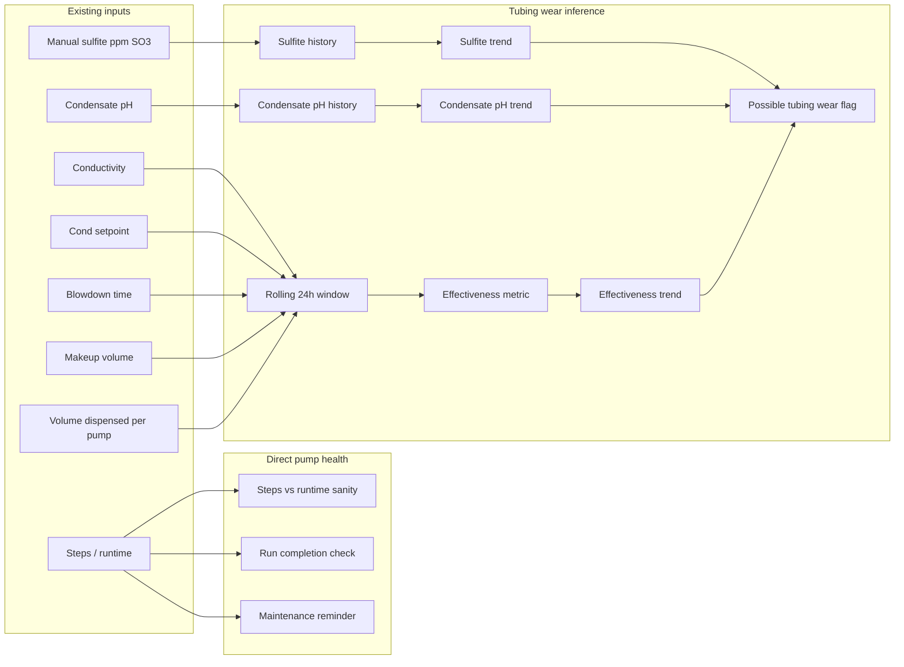

# Pump Health Monitoring and Tubing-Wear Detection Plan

## Current system context

- **Pumps**: Stepper-driven peristaltic (Nema17 + A4988). Volume is inferred from steps via `steps_per_ml`; `[pump_status_t](firmware/esp32_boiler_controller/include/chemical_pump.h)` already has `total_steps`, `volume_dispensed_ml`, `runtime_ms`, and feed-mode state.
- **Process data**: Conductivity (and `cond_trend` µS/cm per minute in [main.cpp](firmware/esp32_boiler_controller/src/main.cpp)), blowdown state and accumulated/total blowdown time ([blowdown.h](firmware/esp32_boiler_controller/include/blowdown.h)), water volume and contacts since last check ([water_meter](firmware/esp32_boiler_controller/include/water_meter.h)), and fuzzy rates for Mode F.
- **Health today**: [sensor_health.h](firmware/esp32_boiler_controller/include/sensor_health.h) covers sensors and safe mode; there is no pump-specific health or tubing-wear logic.

---

## 1. Direct peristaltic pump health (what we can implement)

| Approach                        | Feasibility      | Notes                                                                                                                                                                                                                                                                                                              |
| ------------------------------- | ---------------- | ------------------------------------------------------------------------------------------------------------------------------------------------------------------------------------------------------------------------------------------------------------------------------------------------------------------ |
| **Runtime vs steps sanity**     | Yes, no HW       | For each run: steps and runtime are related by configured speed. Check that effective rate (steps/sec) is within expected range to catch gross misconfiguration or driver issues.                                                                                                                                  |
| **Stall / mechanical blockage** | Only with new HW | Current design is open-loop (AccelStepper, no feedback). True stall detection needs either current sensing (e.g. sense resistor + ADC on motor supply) or a driver with stall detection (e.g. TMC with StallGuard). Could add a **future** hook (e.g. `reportStall()` or ADC read) and document required hardware. |
| **Prime/calibration reminder**  | Yes              | Use existing `prime()` and calibration. Optional: time-since-last-prime or total runtime per pump to suggest tubing replacement (e.g. every N hours or M liters from `total_steps`/`steps_per_ml`).                                                                                                                |
| **Commanded vs "running"**      | Partially        | We already have state (IDLE/RUNNING/ERROR) and time limits. Could add a simple "pump was commanded but never reached target steps in time" check if we track target vs actual per run.                                                                                                                             |

**Recommendation**: Implement **runtime vs steps sanity** and **optional run-completion check** (target steps reached in expected time window). Document stall detection and "hours/volume until tubing change" as optional extensions with or without hardware.

---

## 2. Indirect tubing-wear detection (water conditions vs water consumed and blowdown)

Worn tubing reduces actual chemical delivered per step while the controller still assumes nominal `steps_per_ml`. So we see **same or more commanded dose** but **weaker conductivity response** (e.g. conductivity stays high or drifts up relative to setpoint).

### 2.1 Data we have (no new sensors)

- **Water side**: Makeup volume (water meter: `getVolumeSinceLast(2)`, `getCombinedFlowRate()`), blowdown time (`getAccumulatedTime()`, `getTotalBlowdownTime()`).
- **Dosing side**: Per-pump volume dispensed (`getTotalVolumeMl()` / `volume_dispensed_ml` from steps and `steps_per_ml`), and for Mode F the intended dose (water_volume × ml_per_gallon × fuzzy_rate).
- **Result**: Conductivity and `cond_trend` (already computed in main loop).

### 2.2 Possible algorithms

**A. Rolling "dosing effectiveness" (recommended baseline)**  

- Over a sliding window (e.g. 24 h), track:
  - **Dose delivered**: Sum of volume dispensed per pump (or per pump that affects conductivity most, e.g. NaOH/caustic if that's the main driver of setpoint).
  - **Load**: Makeup volume (gallons) and/or blowdown time (minutes).
  - **Conductivity outcome**: Mean or median conductivity, or time above setpoint, or integral (conductivity − setpoint) when positive.
- Define a simple metric, e.g.  
`effectiveness = (blowdown_time_or_makeup_volume) / (volume_dispensed + ε)`  
or "conductivity error integral per liter dispensed."  
- **Tubing wear signal**: Effectiveness **declining over days** (e.g. we need more dispensed volume to achieve the same conductivity behavior) → flag "possible tubing wear or under-dosing."

**B. Expected vs actual conductivity (simple mass balance)**  

- At quasi steady state, concentration is related to: (dissolved solids in + chemical in) vs (blowdown removal). With setpoint and blowdown time (and optionally makeup volume as proxy for load), we can estimate an "expected" conductivity range for the current dose rate.
- If **actual conductivity is consistently above** that range while dose (steps → ml) and blowdown are "normal," we infer less chemical is reaching the water → possible tubing wear.
- Requires a minimal model (e.g. cond ∝ dose_rate / blowdown_rate with one or two tuned constants) and careful handling of units (blowdown time vs flow if we only have time).

**C. Trend-only flag (simplest)**  

- If conductivity **trend** (`cond_trend`) is positive over a long window (e.g. 6–24 h) while:
  - Fuzzy rate (Mode F) or dose commands are **not** decreasing, and  
  - Blowdown time is **not** reduced,  
  then flag "conductivity drifting high despite normal dosing" (possible wear or feedwater change).

**Recommendation**: Start with **A (dosing effectiveness)** and optionally **C (trend flag)**. Add **B** later if you want a more model-based check. All can run in firmware with rolling buffers (e.g. 24 h of hourly or 10-min buckets) to limit RAM.

---

### 2.3 Sulfite drop-test trending (operator input for sulfite-pump health)

Sodium sulfite can be checked with a **sulfate/sulfite manual drop test** (ppm SO3). The system already accepts this as an operator entry: [web UI and API](firmware/esp32_boiler_controller/src/web_server.cpp) store sulfite in `_manual_tests[2]` (value, valid, timestamp) and pass it to the fuzzy controller via `setManualInput(FUZZY_IN_SULFITE, value, true)` for dosing control.

**Use for pump health**: Treat manual sulfite as a **trending input** for the **amine/sulfite pump** (PUMP_AMINE):

- **Logic**: If water usage, blowdown time, and **sulfite pump dose delivered** (volume from steps) are **stable or unchanged**, but **operator-entered sulfite is trending down** over time, then the **actual dose reaching the water is less than intended** → flag possible sulfite-pump tubing wear or under-dosing.
- **Data needed**:
  - **Sulfite history**: Each time the operator enters a new sulfite value (ppm SO3), store it with timestamp in a small rolling history (e.g. last 5–10 entries or last 7–14 days) so the pump health module can compute **sulfite trend** (e.g. ppm per day or slope over last N samples).
  - **Stable "other parameters"**: Over the same window, compare water volume (makeup), blowdown time, and sulfite-pump volume dispensed. If they are roughly unchanged while sulfite is falling, the wear signal is valid; if water or blowdown increased a lot, sulfite drop could be due to load, not pump delivery.
- **Implementation**: Pump health module (or a shared "manual test history" helper) must be **fed each new sulfite entry** when the operator submits it (e.g. from web server when `_manual_tests[2]` is updated). Store (timestamp, sulfite_ppm) in a ring buffer or small list. Periodically compute trend (e.g. linear regression or end-point slope) and compare to sulfite-pump volume and water/blowdown deltas. If trend is negative and dosing/water/blowdown are stable → set **sulfite pump health flag** ("possible tubing wear" / "check sulfite pump tubing").
- **Scope**: No new sensor; reuses existing manual sulfite entry. Only addition is **sulfite value history** and trend vs pump dose/water/blowdown in the pump health logic.

### 2.4 Condensate pH trending (amine pump / neutralizing amine)

For **neutralizing amine** (condensate treatment), **condensate pH** is the indicator. Same idea as sulfite: compare trend in the indicator to instructed doses, water consumption, and blowdown.

**Logic**: If **condensate pH is trending lower** over time despite **no change in** amine pump dose delivered, water consumption, or blowdown intervals, then less amine is reaching the condensate line → **amine pump tube wear or occlusion**.

**Data needed**:

- **Condensate pH history**: Each time the operator enters a condensate pH value (manual test), store (timestamp, pH) in a rolling history so the pump health module can compute **pH trend** (e.g. pH units per day or slope over last N samples).
- **Stable "other factors"**: Over the same window, amine-pump volume dispensed, makeup water volume, and blowdown time. If these are roughly unchanged while condensate pH is falling → flag amine pump tubing wear/occlusion.

**Implementation (Option B — required)**: **Condensate pH is not the same as boiler water pH.** Add a **dedicated "condensate pH"** manual field, separate from the existing boiler water pH entry (`_manual_tests[3]`): add a new manual test slot or config field for condensate pH (value, valid, timestamp), e.g. in web server (extend `_manual_tests` or add a dedicated `condensate_ph` struct), and in API/UI as a separate input ("Condensate pH"). Pump health trends only this condensate pH series; boiler water pH remains for fuzzy/dosing. On each condensate pH submission: store (timestamp, pH), call `pumpHealth.reportCondensatePh(pH, millis())`, and compute trend vs amine-pump volume and water/blowdown.

**Scope**: New manual entry (condensate pH) in web UI and backend; one rolling series (condensate pH history) and one flag: "amine pump: possible tubing wear/occlusion" when condensate pH trends down with stable dosing and load.

### 2.5 Steam load proxy and CO2 risk (amine health context)

**Steam load proxy**: Use **makeup water used** (volume over the trending window from the water meter) as a proxy for steam load: more makeup implies more steam/condensate return and higher amine demand. When evaluating amine pump health and condensate pH, compare condensate pH (and its trend) to amine dose delivered and makeup water over the same window; normalize by load (e.g. amine dose per gallon makeup). If pH is low while dose per gallon makeup is unchanged, that supports a pump wear signal; if makeup increased a lot, low pH may be load-related.

**CO2 risk via bicarb alkalinity**: Bicarbonate alkalinity (ppm as CaCO3) is a standard proxy for CO2 risk in condensate. Compute from existing manual tests: **Bicarb_alk = max(0, M_alk - 2*P_alk)** where M_alk = M-alkalinity (total alkalinity, `_manual_tests[1]`) and P_alk = P-alkalinity (phenolphthalein, `_manual_tests[4]`), both ppm as CaCO3. High Bicarb_alk means higher CO2 risk. When condensate pH is low or trending down: if Bicarb_alk is high, CO2 may be contributing (interpret amine need vs pump wear in that context); if Bicarb_alk is low and dose/load are stable, stronger signal for amine pump tubing wear/occlusion. Compute Bicarb_alk when M_alk and P_alk are valid; feed into pump health so amine logic uses condensate pH vs amine dose vs makeup (steam load proxy) vs CO2 risk (bicarb) together. No new manual fields; reuse makeup water and existing M_alk/P_alk.

---

## 3. Implementation sketch

- **New module** (e.g. `pump_health.h`/`.cpp` or extend a small "dosing health" module):
  - **Direct pump health**:  
    - On each run completion (or in `ChemicalPump::update()` when transitioning from RUNNING to IDLE): compute steps/sec from `runtime_ms` and steps; compare to configured speed (with tolerance). Optionally: check "target steps reached within expected time."
    - Optional: maintenance counters (total runtime or total volume) and a configurable "tubing change interval" (hours or liters) for a "consider tubing change" warning.
  - **Indirect tubing-wear**:
    - Rolling window (e.g. 24 h) of: per-pump `volume_dispensed_ml` (delta since last sample), makeup volume (gal), blowdown time (min), conductivity, and setpoint.
    - Compute effectiveness (e.g. dose per gallon or per blowdown-minute, or "cond error per liter dispensed") and a medium-term trend (e.g. last 7 days).
    - If effectiveness drops beyond a threshold (e.g. % drop) or conductivity trend is persistently positive with normal dosing, set a **pump/dosing health flag** (e.g. "possible tubing wear").
  - **Sulfite drop-test trending** (sulfite residual → sulfite/amine pump):
    - When operator enters sulfite (manual drop test), feed (timestamp, sulfite_ppm) into a **sulfite history** (ring buffer or last N entries) so the module can compute sulfite trend.
    - Compare sulfite trend to water usage, blowdown time, and sulfite-pump volume dispensed over the same window. If sulfite is **trending down** while those are **stable** → set **sulfite-pump tubing wear** flag.
    - Integration point: call into pump health from web server when `_manual_tests[2]` is updated with a new sulfite value.
  - **Condensate pH trending** (amine pump / neutralizing amine):
    - When operator enters condensate pH (dedicated condensate pH field only; see Option B in 2.4), feed (timestamp, pH) into a **condensate pH history**. Compute pH trend (e.g. slope over last N entries).
    - **Steam load proxy**: Use **makeup water** (volume over window) as steam load proxy; compare condensate pH and amine dose **per gallon makeup** so low pH with unchanged dose/gallon supports pump wear; high makeup with low pH may be load-related.
    - **CO2 risk**: Compute **Bicarb_alk = max(0, M_alk - 2*P_alk)** from `_manual_tests[1]` (M_alk) and `_manual_tests[4]` (P_alk). Use when interpreting low condensate pH: high bicarb → CO2 may be contributing; low bicarb with stable dose/load → stronger amine pump wear/occlusion signal.
    - If condensate pH is **trending lower** while amine dose, makeup (steam load), and blowdown are stable and Bicarb_alk is low → set **amine pump tubing wear/occlusion** flag.
    - Integration: add **dedicated condensate pH** manual field; on submit call `pumpHealth.reportCondensatePh(pH, millis())`; pass makeup volume and (when valid) Bicarb_alk into pump health so amine logic can use steam-load proxy and CO2 risk.
- **Integration**:
  - Feed the module from the existing control loop: conductivity, setpoint, blowdown time, water volume, per-pump volumes (from `getTotalVolumeMl()` or status).
  - **Manual test callbacks**: When operator submits sulfite or condensate pH, call `pumpHealth.reportManualSulfite(ppm, millis())` and/or `pumpHealth.reportCondensatePh(pH, millis())` so the module can update histories and run trend vs dose/water/blowdown.
  - Expose flags (e.g. "pump effectiveness low", "check tubing", "sulfite pump: possible tubing wear", "amine pump: possible tubing wear/occlusion") to [DeviceManager](firmware/esp32_boiler_controller/include/device_manager.h) / alarms or HMI, consistent with [sensor_health](firmware/esp32_boiler_controller/include/sensor_health.h) patterns.
- **Config**: Add optional tuning: window length, effectiveness threshold, trend window, and "tubing change interval" (hours or liters) for the maintenance reminder.

---

## 4. Diagram (data flow)

---

## 5. Summary

- **Direct pump health**: Add runtime vs steps sanity and optional run-completion check; document stall detection and tubing-change intervals for future/hardware.
- **Tubing-wear detection (conductivity-based)**: Use existing water consumed, blowdown time, and dispensed volume to compute a rolling "dosing effectiveness" (and optionally a simple conductivity-trend rule). Flag when effectiveness declines or conductivity drifts up despite normal dosing, indicating possible worn tubing or under-dosing.
- **Sulfite drop-test trending**: Use **operator-entered sulfite** (manual drop test, ppm SO3) as a trending input. When water usage, blowdown time, and sulfite-pump dose delivered are stable but **sulfite is trending down** → set **sulfite-pump tubing wear** flag. Requires sulfite history (timestamp + value) on each manual entry and trend vs pump volume and water/blowdown.
- **Condensate pH trending (amine pump)**: For **neutralizing amine** (condensate treatment), use **condensate pH** as the indicator (Option B: **dedicated condensate pH** field — condensate pH is not the same as boiler water pH). When **condensate pH is trending lower** despite no change in instructed doses, water consumption, or blowdown intervals → **amine pump tube wear or occlusion**. Add a new manual entry "Condensate pH" in UI/API; maintain condensate pH history and trend vs amine-pump volume and water/blowdown; flag "amine pump: possible tubing wear/occlusion."
- **Amine health (steam load + CO2 risk)**: Implement **steam load proxy** from makeup water and **Bicarb_alk = max(0, M_alk - 2*P_alk)** for CO2 risk; use both when evaluating condensate pH vs amine dose (see 2.5).
- **Scope**: One new (or extended) firmware module; sulfite and condensate pH histories and trend logic; steam load proxy and bicarb for amine health; config for thresholds and window lengths; integration into the control loop and into the manual-test submission path (web server); and alarm/device health reporting.
