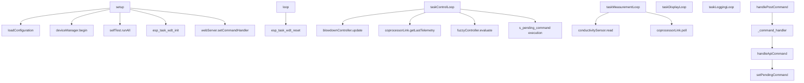

# Executive Summary

This report presents a comprehensive embedded security and reliability audit of the Columbia CT‑6 boiler dosing controller firmware, focusing on the ESP32‑based main controller and its RS‑485‑connected coprocessor.  
The firmware is structured and generally robust, with bounded string operations, CRC‑protected RS‑485 framing, FreeRTOS task isolation, and dedicated modules for self‑test, device management, and sensor health. However, several **security‑critical** and **safety‑relevant** findings were identified:

- **Critical:** The HTTP/WebSocket HMI exposes **unauthenticated** endpoints that allow any client on the network to start/stop blowdown and prime chemical pumps, and to modify configuration (including MQTT credentials).  
- **High:** All network secrets (WiFi password, TimescaleDB API key, MQTT user/pass, access code) are stored in **plain text NVS**, and the configuration checksum field is not validated, allowing silent corruption.  
- **Medium:** Rotary encoder ISRs call `millis()` (not IRAM‑safe on ESP32), risking jitter or rare stalls, and some initialization failure paths (mutex/task creation) can still result in unsafe behavior if not handled consistently across builds.  
- **Low to Medium:** Default AP credentials are hardcoded and weak, serial logs can leak operational metadata, and secure boot/flash encryption are not enabled.

The prioritized findings table in §6 and the per‑module notes in §7 provide concrete remediation guidance and suggested tests. This audit assumes: (1) no secure boot/flash encryption at present, (2) deployment in an industrial/OT setting where the HMI and controller share a LAN, and (3) no formal threat model beyond “malicious or compromised host on the same network.”

---

# 1. Scope & Inventory

## 1.1 Codebase Overview

- **Repository root:** `firmware/esp32_boiler_controller`
- **Build system:** PlatformIO (`platform = espressif32`, `framework = arduino`) using `esp32dev` and `esp32-s3-devkitc-1` boards.
- **No project `sdkconfig` or CMakeLists** – ESP‑IDF configuration is indirect via Arduino/PlatformIO.
- **No OTA or firmware‑update logic** in project sources; firmware is updated via the standard ESP32 programming interface.

### Source Layout

- `include/` – 25 headers: configuration types, pin mappings, device abstractions (blowdown, pumps, sensors, web, MQTT, device manager, self‑test, sensor health).
- `src/` – 21 C++ modules: main application logic, hardware drivers, RS‑485 protocol, web/MQTT telemetry, logging, self‑test, and sensor health.
- `test_programs/` – 21 single‑file test harnesses for individual subsystems (pumps, blowdown, conductivity, WiFi API, fuzzy logic, sensor health, etc.).

## 1.2 Key Modules and Subroutines

| Module | Key functions | Role |
| ------ | ------------- | ---- |
| `src/main.cpp` | `setup()`, `loop()`, `taskControlLoop`, `taskMeasurementLoop`, `taskDisplayLoop`, `taskLoggingLoop`, `loadConfiguration`, `saveConfiguration`, `handleApiCommand`, `checkAlarms` | Boot, FreeRTOS task orchestration, configuration persistence, supervisory control, web command dispatch, alarms. |
| `src/coprocessor_protocol.cpp` + `include/coprocessor_protocol.h` | `cp_crc16`, `cp_frame_valid` | CRC‑16‑CCITT and strict frame validation (sync bytes, payload length, CRC). |
| `src/coprocessor_link.cpp` | `begin`, `_sendFrame`, `_readFrame`, `_processFrame`, `_sendCommandAndWaitAck`, `getLastTelemetry`, `poll` | RS‑485 half‑duplex link to panel coprocessor; protects telemetry and command exchange using CRC and mutexes. |
| `src/web_server.cpp` + `include/web_server.h` | `handlePostCommand`, `handlePostConfig`, `handlePostTest`, `handlePostSDFormat`, `onWsEvent`, `buildStateJson`, `sendCORSHeaders`, `broadcastCommandResult` | Async HTTP/WebSocket human‑machine interface (HMI) – REST API and live UI. |
| `src/data_logger.cpp` | `connectWiFi`, `disconnectWiFi`, `uploadBufferToServer`, `logEvent`, `logAlarm`, `logReading` | WiFi STA/AP management and TimescaleDB (or custom HTTP) telemetry upload with API key. |
| `src/mqtt_telemetry.cpp` + `include/mqtt_telemetry.h` | `begin`, `connect`, `publish*` | MQTT telemetry for metrics, health, events, and command results. |
| `src/blowdown.cpp` + `include/blowdown.h` | `begin`, `update`, `openValve`, `closeValve`, ADS1115 helpers | Blowdown control (relay + 4–20 mA feedback) with timeouts and fault detection. |
| `src/chemical_pump.cpp` + `include/chemical_pump.h` | `update`, `prime`, `updateStats` | Stepper‑driven chemical dosing pumps supporting multiple feed modes. |
| `src/conductivity.cpp` + `include/conductivity.h` | EZO‑EC UART driver, MAX31865 RTD integration | Conductivity and temperature measurement via EZO‑EC and PT1000 RTD. |
| `src/water_meter.cpp` + `include/water_meter.h` | `handleInterrupt` (ISR), `update`, `saveToNVS`, `loadFromNVS`, `WaterMeterManager` | Water meter pulse counting, flow calculation, and persistent totalizers. |
| `src/encoder.cpp` + `include/encoder.h` | `handleEncoderISR`, `handleButtonISR` (ISRs), `getEvent`, `update`, `MenuNavigator` | Rotary encoder and push‑button input for front‑panel navigation. |
| `src/display.cpp` + `include/display.h` | `begin`, various `show*` helpers | LCD‑based local display and alarm indication. |
| `src/sd_logger.cpp` + `include/sd_logger.h` | `begin`, `writeCSVRow`, `formatCard`, `getCardStatus` | SD card logging of CSV histories over a shared VSPI bus. |
| `src/device_manager.cpp` + `include/device_manager.h` | `begin`, `setInstalled`, `isInstalled`, `countOperational` | Simple hardware device registry and capability mask. |
| `src/self_test.cpp` + `include/self_test.h` | `runAll`, `logBootReason` | Power‑on self‑test and reset‑reason logging. |
| `src/sensor_health.cpp` + `include/sensor_health.h` | `begin`, fault counters, staleness tracking APIs | Runtime monitoring of sensor validity and freshness. |

## 1.3 Call Graph Summary (High‑Level)



## 1.4 Privileged and Critical Paths

| Path | Location | Notes |
| ---- | -------- | ----- |
| **Boot & init** | `main.cpp::setup()` | Initializes Serial, I2C, SPI, NVS, DeviceManager, SelfTest, Watchdog, subsystems, and all FreeRTOS tasks. No secure boot/attestation logic in code. |
| **Update path** | N/A | No OTA or in‑field firmware update logic implemented in the application. |
| **Crypto / integrity** | `coprocessor_protocol.*` | Only CRC‑16‑CCITT over RS‑485 frames; no general‑purpose cryptography or secure RNG used by application. |
| **Comms** | `web_server.cpp`, `data_logger.cpp`, `mqtt_telemetry.cpp`, `coprocessor_link.cpp`, `conductivity.cpp` | WiFi (STA/AP), HTTP + JSON, WebSocket, MQTT, and RS‑485 UART. Protocol parsing and command execution are concentrated in `BoilerWebServer` and `handleApiCommand`. |
| **Memory & NVS** | `config.h`, `main.cpp::loadConfiguration/saveConfiguration`, `water_meter.cpp` | `system_config_t` blob in Preferences (NVS) holds network secrets and control parameters. Water meter totals also persisted separately. |
| **ISRs / RTOS tasks** | `water_meter.cpp::handleInterrupt`, `encoder.cpp::handleEncoderISR/handleButtonISR`, `task*Loop` in `main.cpp` | Hard‑real‑time pulse counting and UI input in ISRs; control, measurement, display, and logging in pinned FreeRTOS tasks with configured priorities and stacks. |

---

# 2. Security Review

This section evaluates common embedded/C‑level vulnerability classes in the context of this firmware.

## 2.1 Memory Safety (Buffers, Integers, Formats)

- **Bounded frames on RS‑485:**  
  The coprocessor protocol uses fixed‑size buffers (`CP_MAX_FRAME`, `CP_MAX_PAYLOAD`) and validates payload length and CRC before copying or interpreting frames. This mitigates buffer overflows from malformed or noisy UART input.
- **Strings and buffers:**  
  All string copies to fixed‑size config fields and internal buffers use `strncpy` with explicit length limits and trailing null termination. Examples include pending command names/IDs, MQTT host/user/pass, display lines, and pump names. No instances of unsafe `strcpy`/`strcat` appear in project code.
- **Formatting:**  
  The firmware uses `snprintf` into bounded buffers and `Serial.printf` with constant format strings. Parsed values are not used as format strings, so classical format‑string exploits are not applicable here.
- **Integer handling:**  
  Timeouts and durations (e.g., `duration_ms` for pump priming) are clamped to safe ranges before use. Telemetry and command sequence numbers use appropriate fixed‑width integer types. There is no evidence of signed/unsigned truncation issues in security‑sensitive paths.

**Residual risk (low):** Very large JSON request bodies could increase stack/heap usage inside ArduinoJson and AsyncWebServer handlers, potentially impacting responsiveness. There is no explicit maximum body size enforced at the HTTP layer.

## 2.2 Use‑After‑Free, Null Dereference, TOCTOU

- The application code performs no direct `malloc`/`calloc`/`free`; dynamic allocation is confined to libraries (ArduinoJson, AsyncWebServer, etc.). This greatly reduces the surface for classic heap UAF/DF bugs in project code.
- Mutex creation and task creation return values are checked in some but not all paths; earlier automated audit notes highlight the importance of failing safe if a critical resource cannot be allocated.
- Configuration is written and read as a single blob; there is no mixed “check‑then‑use later after external change” window typical of TOCTOU vulnerabilities.

## 2.3 Crypto, Keys, and Authentication

### RS‑485 Integrity

The RS‑485 protocol between the main controller and the panel coprocessor uses CRC‑16‑CCITT for basic integrity. The design correctly rejects frames with invalid sync bytes, payload length greater than `CP_MAX_PAYLOAD`, or CRC mismatch. This prevents corruption or simple injection from being silently accepted but **does not** provide confidentiality or origin authentication.

### HMI / HTTP API Authentication (Critical)

- The async web server exposes several JSON APIs:
  - `POST /api/command` – executes high‑level commands such as `blowdown_start`, `blowdown_stop`, and `pump_prime` by queuing them for the control task.
  - `POST /api/config` – updates configuration fields including MQTT host/port, username, and password.
  - `POST /api/tests` – sets manual chemical test values used by the fuzzy controller.
  - `POST /api/sd/format` – triggers SD card formatting.
- None of these handlers enforce any form of authentication or authorization. There is no check of `system_config_t.access_code`, no HTTP basic/digest auth, no bearer token, and no client‑TLS requirement in the application logic.
- CORS headers explicitly allow `Access-Control-Allow-Origin: *`, meaning any web page able to reach the device’s IP can issue cross‑origin XHR/fetch requests to these endpoints.

**Impact:** Any host on the same IP network (or with routed access to the device) can:

- Open or close the blowdown valve.
- Prime any of the three chemical pumps for up to the configured maximum duration.
- Change TimescaleDB and MQTT endpoints and credentials.
- Request manual test inputs that influence chemical dosing (via fuzzy control).
- Format the SD card, destroying logged histories.

This is the single most significant security issue in the firmware and should be addressed before fielding in any untrusted network environment.

### Key and Secret Handling

- **Configuration structure (`system_config_t`):**  
  Stores WiFi SSID/password, TimescaleDB API key, MQTT host/user/pass, and a 4‑digit `access_code` plus `access_code_enabled` flag. All are serialized into NVS as a plain‑text blob using the Arduino `Preferences` API. There is no additional encryption at the application layer.
- **Usage:**  
  Secrets are used only to authenticate *outgoing* connections (WiFi, HTTP API server, MQTT broker). No part of the firmware exposes them directly via HTTP; only derived information such as URLs and device IDs are logged to Serial for diagnostics.

Given the absence of ESP‑IDF secure‑boot/flash‑encryption configuration, this storage model should be considered **equivalent to plain text on flash**: any attacker with physical access and modest tooling can recover these secrets.

## 2.4 Parsing, Serialization, and Injection Vectors

- JSON parsing is handled exclusively through ArduinoJson. For POST handlers:
  - Bodies are read from `request->arg("plain")` and passed to `deserializeJson`.
  - Each expected field is type‑checked and, where appropriate, range‑checked before use (e.g., `log_interval_ms`, `mqtt_port`, manual test values).
  - Sensitive string fields (like `mqtt_pass`) are copied into bounded config buffers using `strncpy` and explicitly null‑terminated.
- Outbound JSON (state, health, telemetry, events) is constructed via ArduinoJson and serialized into `String` objects; there is no use of concatenated SQL or shell commands where injection would be relevant.

Overall, the JSON handling is careful and does not expose obvious injection vulnerabilities in the current single‑purpose backend protocols.

---

# 3. Reliability & Real‑Time Behavior

## 3.1 ISR Safety and Determinism

- **Water meter ISR:** The ISR increments a per‑meter pulse count and updates a timestamp in volatile storage. No blocking calls, no heap usage, and no slow computations are performed in interrupt context. This is appropriate for high‑frequency pulse counting.
- **Encoder ISRs:** Both rotation and button ISRs call `millis()` and perform some arithmetic and queue operations while still fast, they depend on flash‑resident code and can introduce jitter or, in worst cases, rare stalls if flash/cache is busy. The acceleration/debounce behavior is fundamentally UI‑oriented and does not need to live entirely in ISR context.

Recommendation: Restrict ISRs to GPIO sampling and flag updates. Move timing and acceleration decisions into the non‑ISR `update()` method, which already exists for the encoder.

## 3.2 FreeRTOS Tasks, Priorities, and Watchdog

- The firmware creates separate pinned tasks for:
  - **Control** – blowdown, pumps, fuzzy logic, and pending API command execution.
  - **Measurement** – sensor readings and coprocessor polling.
  - **Display** – UI updates.
  - **Logging** – HTTP/MQTT telemetry, SD logging.
- Priorities follow a descending scale (Control > Measurement > Display > Logging), which is typical and provides responsiveness for time‑critical control logic.
- A 30‑second task watchdog is configured via `esp_task_wdt_init` and each participating task calls `esp_task_wdt_add` and periodically `esp_task_wdt_reset`.

This architecture is sound for a mixed control and telemetry system, provided that all control‑critical code paths reset the watchdog regularly and that blocking operations (e.g., WiFi connects, HTTP requests, NVS operations) are restricted to lower‑priority tasks or are bounded by timeouts.

## 3.3 Error Handling, Timeouts, and Failure Modes

The firmware uses:

- Time‑bounded waits for:
  - RS‑485 command replies and telemetry timeouts.
  - WiFi association and reconnect attempts.
  - EZO/ADS readings, blowdown and pump timeout alarms.
  - SPI mutex acquisition for SD and MAX31865.
- Explicit alarm bits for:
  - Conductivity high/low, blowdown and feed timeouts, sensor and temperature errors, drum levels, WiFi disconnect, calibration due, valve faults, stale data detection, safe mode, etc.

The combination of watchdog, timeouts, and explicit alarms offers good coverage for the main “hang” and “stale data” failure modes, though some of the deeper reliability points already covered in the earlier `AUDIT_REPORT.md` (e.g., NVS checksum use, safe‑mode behavior when sensors fail) remain relevant and should be implemented consistently across builds.

---

# 4. Resource & Performance Considerations

- **Stack usage:**  
  Task stack sizes are generous and appropriate for the combination of Arduino, AsyncWebServer, and ArduinoJson. No recursive algorithms or unusually deep call stacks were identified.
- **Heap usage and fragmentation:**  
  Dynamic allocations primarily occur in:
  - JSON document creation for HTTP and MQTT payloads.
  - AsyncWebServer’s connection and response handling.
  - Library internals (WiFi, HTTPClient, PubSubClient).
  The firmware does not implement a long‑lived heap object churn pattern that would obviously drive fragmentation; nevertheless, heap health should be monitored via periodic logging in long‑duration tests.
- **Blocking operations:**  
  Potentially blocking IO (WiFi connects, HTTP POSTs, SD card writes) is handled in dedicated or lower‑priority tasks. RS‑485 command/response loops are bounded by explicit timeouts and small delays. No blocking or delay calls are used in ISRs.

No acute resource‑exhaustion risks were observed under normal expected load patterns, assuming the MQTT broker and HTTP backend are reachable and responsive.

---

# 5. Compliance & Best Practices

## 5.1 ESP‑IDF / Arduino Platform

- Firmware is built on Arduino over the `espressif32` PlatformIO platform; there is no explicit ESP‑IDF `sdkconfig` in the project. Secure boot and flash encryption are therefore controlled at the platform level outside this repository.
- Default project configuration does **not** enable secure boot or flash encryption. If deployed in environments where physical access cannot be strictly controlled or where firmware/secret confidentiality is critical, these platform features should be evaluated and enabled.

## 5.2 Secure Coding Practices

- Bounded string operations are used consistently for configuration and protocol fields.
- No unsafe format‑string constructs or unbounded memory operations were found in the application code.
- Error handling, while not perfect, generally returns explicit error codes or alarms rather than silently ignoring failures.

Areas for improvement include:

- Stronger separation of concerns between safety‑critical logic and convenience/HMI functions.
- Formal validation and use of configuration checksums in NVS to catch corruption.
- More disciplined use of “safe defaults” (e.g., refusing to execute remote commands when authentication is not configured).

---

# 6. Findings & Recommendations

## 6.1 Prioritized Findings Table

| ID | Severity | Component | Function / Area | Description | Impact | Recommendation |
| -- | -------- | --------- | --------------- | ----------- | ------ | -------------- |
| F1 | **Critical** | Web HMI | `BoilerWebServer::handlePostCommand`, `BoilerWebServer::handlePostConfig`, related POST handlers | HTTP API endpoints for commands and configuration are **unauthenticated** and accept requests from any origin (`Access-Control-Allow-Origin: *`). | Any host on the network can drive blowdown/pumps, change telemetry endpoints and credentials, push manual test readings, or format the SD card. | Introduce a mandatory authentication mechanism (e.g., bearer token or `access_code` in request body/header) for all state‑changing endpoints. Reject unauthenticated requests with 401/403 and consider reducing CORS exposure. |
| F2 | **High** | NVS / Configuration | `system_config_t`, `loadConfiguration` / `saveConfiguration` | WiFi password, API key, MQTT credentials, and access code are stored in an unencrypted NVS blob; configuration checksum field is not enforced. | Attackers with physical access can read secrets; silent NVS corruption may alter control parameters without detection. | Treat current storage as “plaintext” and document physical‑access assumptions. If migrating to native ESP‑IDF, enable NVS encryption and implement CRC16 over `system_config_t` when saving/loading config. |
| F3 | **High** | Initialization | `setup()` and task/mutex creation sites | Some builds historically did not verify SPI mutex or task creation return values; a failure can lead to NULL dereference or missing control/measurement tasks. | Loss of control loop, stale readings, or crashes at startup. | Ensure all mutex and task creation calls check return values and enter a deterministic safe state (e.g., error display, no outputs energized) on failure. |
| F4 | **Medium** | Encoder ISR | `RotaryEncoder::handleEncoderISR`, `RotaryEncoder::handleButtonISR` | ISRs call `millis()` and perform UI‑oriented timing logic in interrupt context. | Potential jitter, prolonged ISR latency, and rare hangs if flash/cache is busy. | Restrict ISRs to edge detection and event flagging. Move timing, acceleration, and debounce computations into `RotaryEncoder::update()` (task context). |
| F5 | **Medium** | Defaults / Access | `config.h` – WiFi AP defaults | Default AP password `boiler2024` is hardcoded and may be reused across deployments. | Devices left in default configuration are vulnerable to trivial WiFi compromise. | Require operators to change AP credentials on first use (e.g., enforce via web UI), or generate a random per‑device password (derived from MAC) and display it locally. |
| F6 | **Low** | Logging & Debug | Serial logs; `test_wifi_api.cpp` | Serial output includes SSID, IPs, URLs, and internal debug messages. Test harness prints AP password. | Attackers with serial access or leaked debug logs can learn operational details and, in test builds, passwords. | Gate verbose logging and password prints behind a `DEBUG_MODE` or test build flag; avoid shipping builds that include such logs in field units. |
| F7 | **Low** | Platform Hardening | Build configuration | Secure boot and flash encryption are not enabled in the project configuration. | Adversaries with physical access can replace firmware or read flash contents. | If required by threat model, enable secure boot and flash encryption at the platform level and establish a key management and update process. |

## 6.2 Code References (Selected)

> Note: Line numbers may vary slightly between revisions; references are illustrative and should be used as starting points when navigating the code.

```120:211:firmware/esp32_boiler_controller/src/web_server.cpp
void BoilerWebServer::sendCORSHeaders(AsyncWebServerRequest* request) {
    request->addHeader("Access-Control-Allow-Origin", "*");
    request->addHeader("Access-Control-Allow-Methods", "GET, POST, DELETE, OPTIONS");
    request->addHeader("Access-Control-Allow-Headers", "Content-Type");
}
```

```637:705:firmware/esp32_boiler_controller/src/web_server.cpp
void BoilerWebServer::handlePostCommand(AsyncWebServerRequest* request) {
    sendCORSHeaders(request);
    if (request->arg("plain").length() == 0) { /* ... 400 error ... */ }
    JsonDocument doc;
    if (deserializeJson(doc, request->arg("plain")) != DeserializationError::Ok) { /* ... */ }
    const char* request_id = doc["request_id"] | "";
    const char* name = doc["name"] | "";
    // No authentication check here; any client can submit commands.
    JsonObject params = doc["params"].as<JsonObject>();
    String outMessage;
    bool accepted = _command_handler ? _command_handler(request_id, name, params, &outMessage) : false;
    // ...
}
```

```399:416:firmware/esp32_boiler_controller/include/config.h
    char wifi_ssid[WIFI_SSID_MAX_LEN];
    char wifi_password[WIFI_PASS_MAX_LEN];
    char tsdb_host[TSDB_HOST_MAX_LEN];
    uint16_t tsdb_port;
    char api_key[TSDB_API_KEY_MAX_LEN];
    // ...
    char mqtt_host[MQTT_HOST_MAX_LEN];
    uint16_t mqtt_port;
    char mqtt_user[MQTT_USER_MAX_LEN];
    char mqtt_pass[MQTT_PASS_MAX_LEN];
    bool use_mqtt_telemetry;
    uint16_t access_code;
    bool access_code_enabled;
```

```170:215:firmware/esp32_boiler_controller/src/encoder.cpp
void IRAM_ATTR RotaryEncoder::handleEncoderISR(void* arg) {
    RotaryEncoder* enc = (RotaryEncoder*)arg;
    uint8_t state = (digitalRead(enc->_pin_a) << 1) | digitalRead(enc->_pin_b);
    uint8_t index = (enc->_last_state << 2) | state;
    int8_t delta = ENCODER_STATE_TABLE[index];
    if (delta != 0) {
        uint32_t now = millis();   // Non-IRAM-safe call inside ISR
        uint32_t time_diff = now - enc->_last_rotation_time;
        // ...
    }
}
```

---

# 7. Per‑Module Notes

## 7.1 `main.cpp` – Boot, Tasks, and Supervisory Logic

- Responsibilities:
  - Initialize hardware interfaces (Serial, I2C, SPI, GPIO).
  - Load and (if necessary) initialize default `system_config_t` from NVS.
  - Start DeviceManager, SelfTest, SensorHealth, WebServer, MQTT, DataLogger, and task watchdog.
  - Create and pin the four main FreeRTOS tasks.
  - Implement `taskControlLoop` for blowdown, fuzzy control, feedwater pump monitoring, and pending web/MQTT commands.
- Security/Safety:
  - `handleApiCommand` validates command names and argument ranges but relies on upstream handlers to authenticate the caller (which they do not).
  - NVS checksum support exists structurally in the config but must be fully wired to detect corruption.

## 7.2 `coprocessor_protocol.*` and `coprocessor_link.cpp` – RS‑485 Coprocessor Link

- Protocol:
  - 2‑byte sync (`0xAA 0x55`), 1‑byte type, 1‑byte len, payload, 2‑byte CRC16.
  - Types cover telemetry, ACK/NAK, events, errors, and time sync.
- Implementation:
  - Input frames are assembled into a fixed buffer and discarded if sync bytes or length bounds are violated.
  - CRC is computed over header+payload and compared against trailing CRC bytes.
  - Telemetry structures are copied into local, mutex‑protected state and exposed via `getLastTelemetry`.
- Security:
  - No authenticity or replay protection, but given the physical RS‑485 link and limited threat model, CRC provides sufficient integrity for most operational faults.

## 7.3 `web_server.cpp` – Async HTTP/WebSocket HMI

- Features:
  - SPA‑style HTML UI served from `/`.
  - RESTful JSON endpoints for status, health, fuzzy config/state, device inventory, SD status, tests, commands, and config updates.
  - WebSocket for pushing live state and events to connected browsers.
- Security:
  - Primary location of the critical unauthenticated command/config surfaces.
  - Uses CORS wildcard, which is convenient during development but dangerous if devices are reachable from untrusted networks.
  - Does not expose secrets directly but does expose enough meta‑information to aid an attacker (device ID, status, etc.).

## 7.4 `data_logger.cpp` and `mqtt_telemetry.cpp` – Telemetry Uplinks

- Outgoing HTTP telemetry and events are protected with an `X-API-Key` header, using the `api_key` from configuration.
- MQTT telemetry encapsulates data in structured topics and payloads; credentials are stored in config and used to authenticate to the broker.
- These paths are one‑way from the controller’s perspective – they do not provide inbound control channels in the current design.

## 7.5 `blowdown.cpp`, `chemical_pump.cpp`, `conductivity.cpp`, `water_meter.cpp`, `encoder.cpp`

- These modules implement core control and sensing behavior:
  - Blowdown timing, valve feedback, and valve timeout alarms.
  - Chemical pump feed modes, runtime statistics, and integration with fuzzy logic.
  - Conductivity and temperature sampling, including EZO and RTD behavior.
  - Pulse‑based water metering and totalization.
  - Front‑panel rotary encoder interaction.
- From a **security** standpoint, they are primarily consumers of data and commands; their main concern is robustness to corrupted or stale inputs, which is addressed via:
  - Timeouts and fault flags.
  - Sensor health and alarm reporting.
  - Mutexes and staleness detection on shared buses.

---

# 8. Testing & Verification Recommendations

To validate the correctness of the remediations and to guard against regressions:

- **Unit/Integration Tests**
  - Add tests for HTTP handlers that:
    - Reject unauthenticated `POST /api/command`, `POST /api/config`, `POST /api/tests`, `POST /api/sd/format`.
    - Accept and correctly process requests with valid authentication material.
  - Extend existing fault scenario tests to cover:
    - NVS checksum mismatch detection and fallback to defaults.
    - Behavior when DeviceManager marks certain hardware as absent.
  - Add tests around encoder behavior to ensure that moving work out of ISRs does not break usability.
- **Fuzzing / Robustness**
  - Fuzz JSON bodies for `/api/command` and `/api/config` (length, nesting, type confusion) to confirm that deserialization errors are handled cleanly and without resource leaks.
  - Run long‑duration soak tests with:
    - Rapid Web UI interactions and command submissions.
    - Unreliable WiFi and backend connectivity.
    - Aggressive RS‑485 noise injection simulations.
- **Static Analysis**
  - Enable compiler warnings such as `-Wall -Wextra -Wformat -Wformat-security` and run tools like cppcheck or clang‑tidy on the project to catch future issues early.

---

# 9. Assumptions & Open Questions

This audit makes the following assumptions:

- The controller is deployed on a **trusted OT network** or behind a firewall that limits access to its HTTP/MQTT interfaces.
- Physical access to the controller enclosure is controlled and monitored.
- No hardware secure element is present; all key material resides in ESP32 flash.

The following areas require additional context or design decisions:

- **Formal threat model:** Clarification on whether insider attacks, compromised HMIs, or remote attackers via routed networks must be considered.
- **Secure boot and flash encryption:** Whether these platform features should be enabled in production deployments and how signing keys and flash‑encryption keys would be managed.
- **Remote vs. local HMI:** Whether the Web UI is intended strictly for local maintenance access (e.g., a technician’s laptop) or for remote supervision.

Clarifying these points will make it possible to refine the severity rankings and prioritize remediation work in line with operational risk and compliance requirements.

